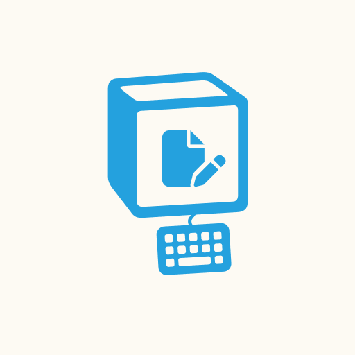

# notion-echo bot

Welcome to the notion-echo Bot, your seamless bridge between Telegram and Notion! Designed with productivity in mind, this bot effortlessly creates callout blocks in a Notion page of your choosing, enabling you to capture ideas, notes, and tasks without ever leaving your Telegram chat and allowing you to write notes on your Notion as you were writing to a friend on telegram. 

Say goodbye to switching apps or losing thoughts in the shuffle—Notion-Echo Bot simplifies your digital life without compromising on privacy or efficiency.

**Key Features:**
- **Instant Note Taking:** Quickly jot down notes directly from Telegram into your Notion page.
- **Flexible Page Selection:** Choose exactly where each note lands in your Notion workspace.
- **Privacy First:** Your data is yours alone. We never store user data, ensuring your notes and ideas remain confidential and secure.

## Getting Started

### Quick Start Guide

1. **Install the Bot:** Search for `notion_echo_bot` in Telegram or click [here](https://t.me/notion_echo_bot) to start.
2. **/register:** Follow the bot's prompts to register your Notion notebook.
3. **/defaultpage page_name:** Set up your default Notion page where all notes will be stored.
4. **/note your_note:** Begin noting down your thoughts and tasks directly into Notion.

### Commands

- `/help` - Displays this help message;
- `/register` - Register your Notion notebook in the bot;
- `/note [text]` - Write the text of the note on Notion or save the file*;
- `/note [--page "page_name"] [text]` - Write the note containing the text, on the page in the parenthesis ("");
- `/defaultpage [page_name]` - Sets the default Notion page for your notes. Ensure this is an authorized page during registration;
- `/getdefaultpage` - Get default page for your user.
- `/deauthorize` - I will forget you

*: Please note that so far only **pdf, jpg, jpeg and png** are able to be uploaded into your page, also, if you are **uploading a picture**, you should upload it **without compression**

## Why Use notion-echo Bot?

- **Efficiency:** Streamline your workflow by eliminating the need to switch between apps.
- **Organization:** Keep your thoughts, tasks, and ideas neatly organized in Notion.
- **Privacy:** We prioritize your privacy. No user data is ever stored or shared.

## Support & Feedback

Your feedback helps us make notion-echo Bot better for everyone. If you encounter any issues or have suggestions, please open an issue in this public repository.

For more information and updates, follow us on [GitHub](https://github.com/fulviodenza/notion-echo).

## Contributing

We welcome contributions of all kinds from the community. 

If you're interested in helping improve notion-echo Bot submit an issue or if you want to discuss features/bugs/other join the telegram group: https://t.me/+BOWbMpNPh6IzNTY0

## Next features
- Storage not depending on telegram but relying on ourself, so that the issue for docs visualization in notion is not broken
- Monitoring (Prometheus)
- Switch default pages
- Create a default page if unset into the Database
- Save new notes formats
  
## Known issues
- transcribe markdown

## Contributors:
- [Diegghh](https://github.com/Diegghh)
- [Ladvace](https://github.com/Ladvace)
